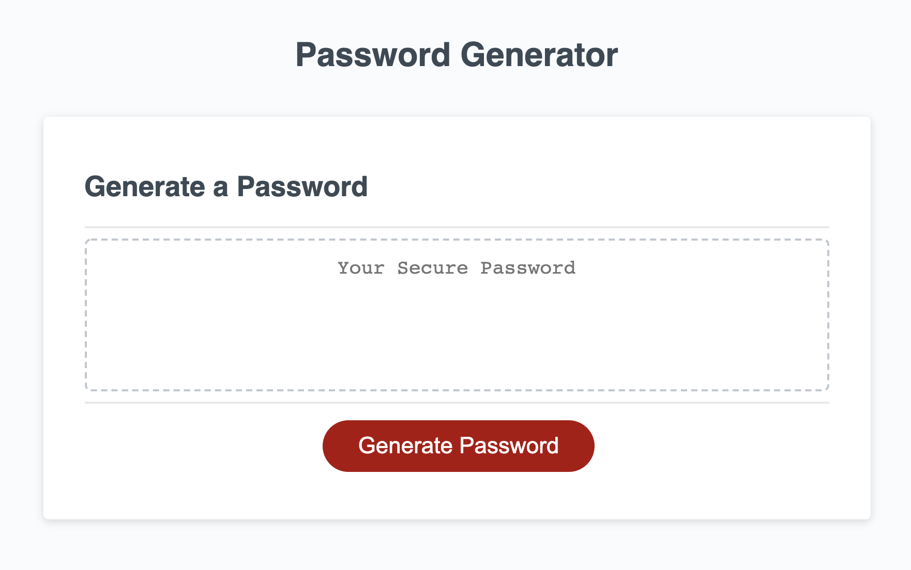

# Password-Generator
The password generator uses a range of javascript characteristics (including functions, math.floor and math.random, for loop, etc.) to allow the user to select the amount of characters they desire in additon to types of characters they wish to include. The site then generates a password based on the users selected criteria. The base of this functionality exists in the "generate password" function, which prompts questions for filtration and then concatenates multiple arrays of characters into a new grand array to randomize from. The generator function knows to stop randomizing characters based on the restrcition of the "for" loop, which contains a corresponding variable that reflects the users chosen amount of characters. Once the generate password button is clicked, the website displays the randomized outcome based on the users choice.

Repo Link: https://github.com/bendrakeacker/Password-Generator
Deployed Link: https://bendrakeacker.github.io/Password-Generator/
